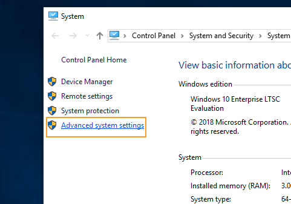
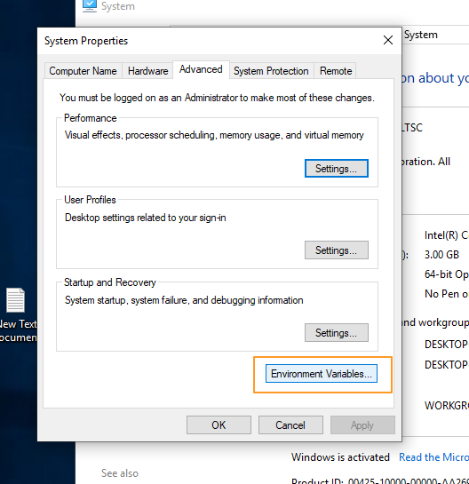
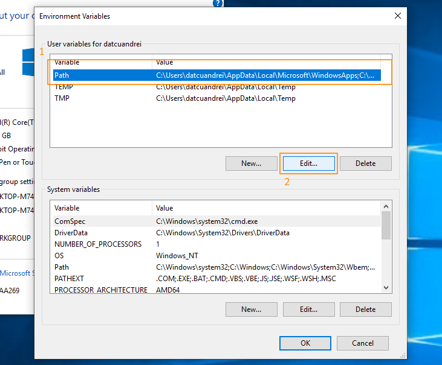
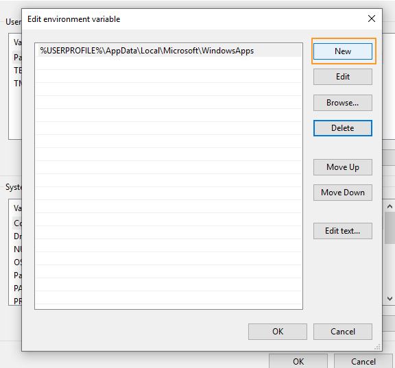
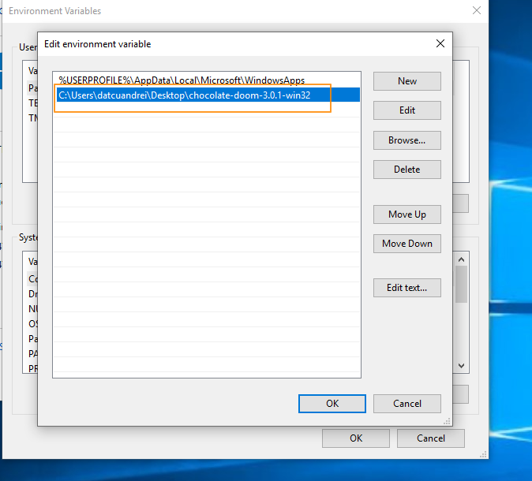
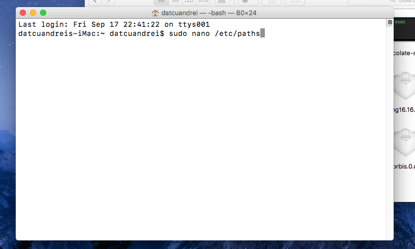
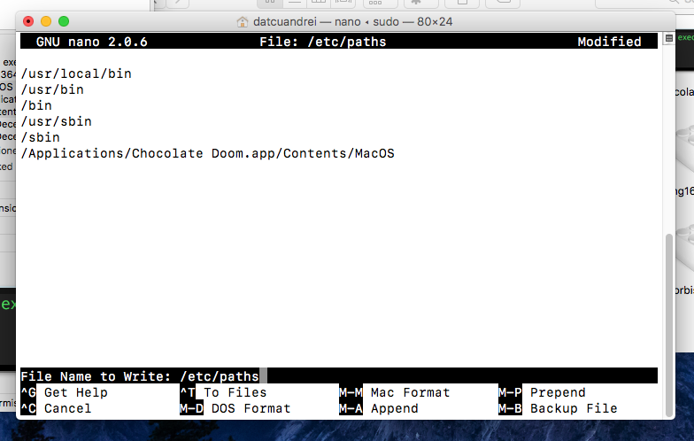

# How to add source ports to your PATH variable
*As it currently stands, you need to add the source ports you want to use with ccdoom to your PATH variable. This is temporary, until a better solution will be implemented.*
*There is no guide for GNU/Linux, because the source ports are installed through packages and they are automatically added to your PATH variable.*

Table of Contents
=================

* [Windows](#windows)
* [macOS](#macos)

# Windows
It takes 5 simple steps to add a DOOM sourceport to your Windows PATH variable.

- In your system properties, go to `Advanced system settings`
 
- Go to `Environment Variables...`
 
- First, select the `Path` variable, and then click `Edit...` 
 
- Select `New` and browse to your source port's executable location
 
- After that is done, click `OK` in all the previous windows to confirm our actions.
 

# macOS
It takes just a couple steps to add a DOOM sourceport to your macOS PATH variable.

- Open terminal and run `sudo nano /etc/paths`. Enter your password.

- Copy the path to your source port's binary and paste it into nano,as shown below.

- Use CTRL+O to save changes and CTRL+X to exit.

That is all it takes!
